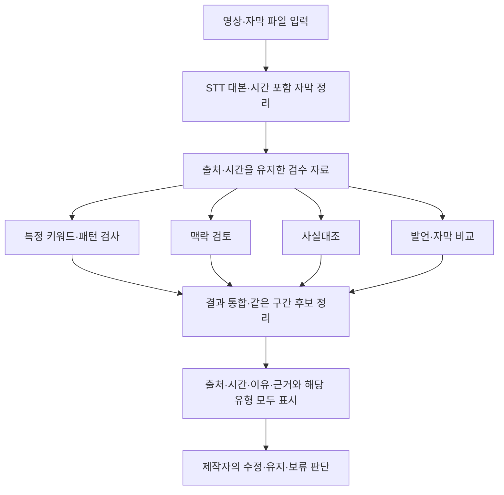

# OoPs?! 전체 기획서

최종 갱신: 2026-10-06

이 문서는 **첨부 Master Context 16개 파일, 실제 제출한 [모두의 창업 지원서 본문](sources/모두의_창업_지원서_본문.md), 현재 대화에서 제공·확정한 기획을 항목별로 모은 기준 문서**다. 모두의 창업 지원서는 2026-09-29 사용자 결정에 따라 현재 기획의 최신 기준 자료로 반영한다. 다만 기존 첫해 매출 계획 2,049,700원은 이전 유료 운영 가정으로 보존한다. 최신 승인인 월 20시간 무료 운영을 현재 기준으로 적용하고, 팀 소개는 익명 번호 대신 역할 중심으로 정리한다. 지원서에 생략된 기존 세부 기획·확정 사항은 취소된 것으로 보지 않는다. 구현 상태는 별도 백엔드 확인 근거로 구분했다. 미결 사항을 없애거나 모든 내용을 구현 완료로 확정한 문서가 아니다. 사용자 답변이 필요한 부분은 [검토 사항](검토_사항.md)에 연결한다.

이번에 다시 첨부한 폴더의 파일 16개와 모두의 창업 지원서 본문을 모두 읽었다.

이전 AI 작업 자료 16개의 본문을 한 번에 읽으려면 [다른 AI 작업 기록](다른_AI_작업_기록.md)을 확인한다. 이 문서와 달리 원문 모음이며 이후 사용자 결정으로 원문을 고쳐 쓰지 않는다.

## 자료와 상태를 읽는 기준

- **첨부 기획:** Master Context 원문에 적힌 방향. 실제 구현·성과를 자동으로 뜻하지 않는다.
- **사용자 제공:** 현재 대화에서 제공한 인터뷰·경력·실험·사업 내용. 외부 검증 완료로 확대하지 않는다.
- **코드 확인:** 백엔드 `e6b7003`에서 확인한 코드·기본 설정. 운영 서버 상태와 다를 수 있다.
- **계획/가설:** 앞으로 검증하거나 구현하려는 사항.
- **확인 필요:** 자료 사이 차이 또는 구체적인 상태가 빠진 사항. 승인 없이 어느 한쪽으로 확정하지 않는다.
- **최신 지원서 기준:** 모두의 창업 지원서의 서술을 현재 사업 설명에 우선 반영한다. 이후 사용자 확정 결정과 충돌하면 그 후속 결정을 우선하며, 지원서에 없는 기존 세부 내용은 삭제 승인으로 해석하지 않는다.

원문은 [sources/OoPs_Master_Context_v1](sources/OoPs_Master_Context_v1)과 [모두의 창업 지원서 본문](sources/모두의_창업_지원서_본문.md)에 바이트 그대로 보관했고, [파일별 SHA-256](sources/manifest.json)을 기록했다. 재구성 전 요약·검토·결정·작업 기록도 [기존 기록 보관함](archive/2026-09-19-before-reorganization)에 남겼다.

## 서비스 개요와 핵심 원칙

OoPs?!는 긴 유튜브 대화형 콘텐츠에서 **공개 전에 다시 확인할 가치가 있는 발언, 자막, 사실 정보, 외부 맥락을 찾아주는 AI 영상 검수 서비스**다.

핵심 가치는 검수 시간 절감, 검토 범위 확장, 근거를 통한 판단 지원, 반복되는 제작·검수 과정의 체계화다. 이는 제공하려는 가치이며, 시간 절감 효과의 실측 결과는 아직 제시되지 않았다.

AI는 검토 후보(Candidate)와 시간 위치(Timestamp)를 제시한다. **확인 이유와 근거를 제공하여 제작자의 최종 판단에 도움을 줄 수 있도록 한다.**

근거: 첨부 [00](sources/OoPs_Master_Context_v1/00_README.md), [01](sources/OoPs_Master_Context_v1/01_Project_Overview.md), [04](sources/OoPs_Master_Context_v1/04_Product_Strategy.md), [모두의 창업 지원서](sources/모두의_창업_지원서_본문.md)의 배경·차별점 설명.

## 문제 발견과 검수의 필요성

**초기 가설**은 제작자가 문제 장면을 놓치므로 AI가 찾아준다는 것이었다. **현재 가설**은 제작자가 이미 검수하고 있지만, 긴 영상에서 외부 맥락과 사실 정보를 동시에 확인하기 어려워 다시 확인할 지점이 남는다는 것이다.

사용자는 김태호 PD 회사의 PD와 크리에이터를 포함한 4명을 인터뷰했다고 설명했다. 인터뷰에서는 편집 과정에서 영상 전체를 반복 검토하고, 논란 가능성이 있는 부분을 논의하거나 삭제한다는 응답을 들었다. 한 참여자는 반복 제작으로 표현에 무뎌지기도 하며 모든 내용을 항상 꼼꼼히 살피기 어렵다고 설명했다. 특정 커뮤니티 용어나 역사적 맥락처럼 의미를 모르면 확인이 필요하다는 사실 자체를 놓칠 수 있다는 점에 주목했다.

따라서 필요한 일은 두 가지가 함께 이루어지는 것이다. 긴 영상에서 다시 살펴볼 부분을 발견하고, 그 부분을 판단할 자료와 배경을 확인해야 한다. 발언·자막의 인물명, 날짜, 숫자는 자료와 대조하고 특정 표현은 앞뒤 대화와 사회적 맥락을 함께 살펴야 한다.

사용자는 공개된 콘텐츠의 논란이 출연자 이미지와 채널 신뢰, 광고·협업에 영향을 줄 수 있다고 설명했다. 신청서 배경 사례로 2024년 피식대학 지역 비하 논란 후 군위군의 촬영 홍보 영상 미활용 및 7,200만원 예산 집행 계획 취소를 제시했다. 제공된 출처 표기는 ‘파이낸셜뉴스, 2024-05-28’이다. 이 문서 작업에서 기사 원문을 새로 검증하지 않았으며, 취소된 예산을 채널의 확정 손실액으로 바꾸지 않는다.

근거: 첨부 [02](sources/OoPs_Master_Context_v1/02_Problem_Discovery.md), [모두의 창업 지원서](sources/모두의_창업_지원서_본문.md)의 사업 배경 원문.

## 목표 고객과 초기 집중 범위

첨부 기획의 초기 타깃은 **연예인이 출연하는 긴 대화형 콘텐츠 제작자와 제작팀**이다. 웹 예능, 인터뷰, 팟캐스트, 크리에이터 협업 콘텐츠를 우선 대상으로 한다.

모두의 창업 지원서에서는 긴 대화형 영상을 반복 제작하는 크리에이터·제작팀 전반을 대상으로 설명하고, 연예인 출연 콘텐츠는 출연자 이미지와 채널 신뢰가 사업에 영향을 주므로 검수 지불 필요가 큰 고객으로 강조했다.

2026-09-19 사용자 확인: 연예인 출연 콘텐츠 제작자·제작팀은 **우선 공략 대상**이며 연예인 출연은 필수 조건이 아니다. 일반 크리에이터·제작팀도 대상에 포함한다. 백엔드의 기존 설명 문서에 적힌 ‘편집을 위임하는 20분 이상 토크·인터뷰 채널’은 **타깃을 구체화한 페르소나 설명**이다. 20분 이상 및 외주 편집은 고객의 필수 조건이 아니다. → [검토 완료 R-08](검토완료사항.md).

근거: 첨부 [03](sources/OoPs_Master_Context_v1/03_Target_Customer.md), [모두의 창업 지원서](sources/모두의_창업_지원서_본문.md)의 고객·수익모델 설명, 백엔드 `docs/프로젝트-현황-정리.md`.

## 고객 이용 흐름과 제공 결과

**영상 업로드 → 분석 → 검토 후보 확인 → 이유·맥락·근거 확인 → 제작자 판단 및 기록**의 흐름으로 설명한다.

제작자는 최종 편집본을 업로드하거나 지원되는 유튜브 링크를 입력한다. 서비스는 음성과 화면 글자를 추출하고 검토 후보를 찾는다. 특정 집단을 지나치게 일반화한 표현, 추가 확인이 필요한 이름·날짜·숫자, 외부 자료로 확인할 수 있는 사실 주장 등을 검토 대상으로 삼는다.

후보는 시간순으로 정리하고 해당 발언 또는 화면 글자, 확인 이유, 관련 자료를 연결한다. 제작자는 장면과 앞뒤 대화, 외부 근거를 함께 확인하고 **수정·유지·보류** 결정을 남긴다. 추가 자료나 출연자 확인이 필요하면 보류하며, 무엇을 검토했고 어떻게 판단했는지 다시 살펴볼 수 있게 한다.

AI는 출연자의 실제 의도나 표현의 옳고 그름을 단정하지 않는다. 인용·반박·농담의 맥락을 고려할 이유를 제시하고, 분석하지 못한 범위는 함께 알린다는 방향이다.

이 항목은 기획 흐름이다. 발언↔자막 직접 비교 등의 현재 활성 여부는 아래 구현 범위를 함께 봐야 한다.

## 검수 유형과 독립 검사 구조 — 2026-09-29 확정 기획

사용자 검토·승인으로 검수 체계를 다음 네 가지로 재분류했다. 아래는 **새 기획의 확정 내용**이며 백엔드 구현 완료를 뜻하지 않는다. 이전의 발언·화면 글자 의미 검토는 맥락 검토로 통합한다.

| 검수 유형 | 무엇을 확인하는가 | 기준과 처리 원칙 |
|---|---|---|
| 특정 키워드·패턴 검사 | 등록된 표현이나 개인정보 형태의 등장 | 기존 65개 키워드 목록과 전화번호·주민등록번호·이메일·계좌번호 등 형식 패턴을 사용한다. 표현·패턴의 발견을 알리며, 그 자체로 부적절함이나 공개 불가를 확정하지 않는다. |
| 맥락 검토 | 발언·화면 글자가 어떤 의미로 쓰였는지 | 아래 세 유형으로 의미를 검토한다. 사전 일치만으로 판단하지 않고, 현재 기획의 맥락 사전 49개 항목 모두 AI 문맥 확인을 거친다. 집단 일반화와 사회적 속성에 근거한 평가·배제는 각각의 4개 확인 항목으로 검토한다. 정치·역사적 배경 및 커뮤니티 은어는 현재 기획의 49개 사전에 해당하는 표현이 있을 때만 문맥을 확인한다. |
| 사실대조 | 확인 가능한 주장과 외부 자료의 차이 | 49개 맥락 사전과 독립적으로 확인 가능한 주장을 추출하면 검색을 시작한다. Perplexity Search API를 메인, Serper를 보조로 자료를 찾아 AI가 대조한다. 자료가 없거나 서로 충돌하면 오류로 단정하지 않는다. 상세 기준은 아래 외부 자료 기반 사실대조 절을 따른다. |
| 발언·자막 비교 | 같은 장면의 발언과 화면 글자의 의미 차이 | 기존 비교 방식을 유지한다. 의미 변화·내용 추가·표현 강도 차이 등을 확인하며, 의미가 같은 요약·단순 표기 차이·OCR 오류를 실제 의미 차이와 구분한다. |

### 초기 분석 입력 — 최신 사용자 승인

초기에는 **음성에서 STT로 만든 대본**과 **제작자가 제공하는 자막·타임스탬프 포함 .txt**를 사용한다. 텍스트·영상 시간·출처를 보존해 네 검사가 독립적으로 검토하고 결과를 통합한다. 자막 파일은 음성 대본을 대신하지 않으며 발언·자막 비교에는 양쪽 입력이 필요하다.

**OCR은 향후 단계로 미루며 초기 개발·비용 산정 범위에서 제외한다.** 자막 파일에 없는 간판·배경·자료화면 글자를 추출했다고 간주하지 않는다. 아래 화면 글자 검토 기준은 유지하되 초기 적용 대상은 제공받은 자막이다. OCR 오류·편집 자막과 배경 글자 구분은 해결된 것이 아니라 향후 미결 과제(R-20)다. 파일 규격·필수 여부·파일 없음·영상과의 시간 불일치 처리도 R-23·GAP-08에서 확인한다. 기존 OCR 코드의 존재와 새 초기 기획의 구현 완료는 구분한다.

### 맥락 검토의 세 유형

| 유형 | 검토 범위 |
|---|---|
| Social context — 사회정치 맥락 | 정치·사건뿐 아니라 성별·국적·장애·지역 등 사회적 속성에 관한 맥락을 포함한다. |
| Group generalization — 집단 일반화 | 일부 사례나 개인의 특성을 집단 전체의 성질로 확대·단정하는 표현을 검토한다. |
| Community context — 특정 커뮤니티 맥락 | 특정 커뮤니티의 은어·밈·말투·상징 등과 연결되는 의미를 검토한다. |

한 후보가 여러 유형에 해당하면 **복수 분류하고 사용자에게 해당 유형을 모두 표시**한다. 세 유형 중 하나를 강제로 선택하지 않는다.

세 유형에 해당하지 않는 **단순한 특정 대상 평가는 맥락 검토에서 제외**한다. 예를 들어 “이 브랜드는 돈값을 못한다”는 평가만으로 맥락 후보를 만들지 않는다. 다만 사회정치·집단 일반화·커뮤니티 맥락이 함께 있으면 해당 기준으로 검토한다. 키워드·패턴 검사와 사실대조는 별도의 기준에 따라 적용한다.

### 맥락 검토의 진입 조건과 판단 기준 — R-17 후속 확정

2026-09-29 후속 사용자 결정으로, 이전의 ‘사전에 없는 문장도 세 유형 모두 검토’ 설명을 다음과 같이 구체화·제한한다. 발언과 화면 글자에 동일한 기준을 적용하되 출처를 구분한다.

| 검토 내용 | 진입 조건 | 판단 방식 |
|---|---|---|
| 집단 일반화 | 사전 일치 여부와 관계없이 검토 | 아래 4개 항목을 원문과 앞뒤 문맥으로 확인한다. |
| 사회적 속성에 근거한 평가·배제 | 사전 일치 여부와 관계없이 검토 | Social context의 하위 기준으로 아래 4개 항목을 모두 확인할 때 후보를 생성한다. |
| 정치·역사적 배경 및 커뮤니티 은어 | 현재 기획의 49개 맥락 사전에 해당하는 표현이 있을 때만 검토 | 사전의 의미 설명을 참고해 실제 사용 문맥과 해당 유형을 판단한다. 사전에 해당하지 않으면 이 배경·은어에 대한 판단을 하지 않는다. 모델의 지식이나 추측으로 우회해 후보를 만들지 않는다. |

**집단 일반화의 4개 확인 항목**

1. **어떤 집단인가?** — 집단을 가리키는 원문을 확인한다.
2. **집단 전체로 확대했는가?** — 전체로 묶거나 일부 사례를 전체로 확대하는 표현과 문맥을 확인한다.
3. **집단에 어떤 성질을 붙였는가?** — 부여한 성질을 원문에서 확인한다.
4. **직접 주장한 것인가?** — 앞뒤 문맥에서 인용·반박·질문 등을 구분한다.

각 항목의 원문과 문맥을 근거로 후보 생성 여부를 판단한다. 예를 들어 “그 지역 사람들은 다 약속을 안 지켜”는 집단·전체화·성질을 확인할 수 있지만, 그 문장을 인용하며 편견이라고 비판하는 경우는 직접 일반화한 발언과 구분한다.

**사회적 속성에 근거한 평가·배제의 4개 확인 항목**

1. **대상·속성:** 누구를 대상으로 성별·국적·장애·지역 등 어떤 사회적 속성을 언급했는가?
2. **평가·배제:** 능력·가치·신뢰를 낮추거나 참여·기회·자격을 부정하는 어떤 표현이 있는가?
3. **연결 관계:** 해당 속성을 평가·배제의 이유로 삼았는가? 연결 표현이나 분명한 문맥이 있는가?
4. **사용 맥락:** 직접 주장한 것인가? 인용·설명·비판·질문과 구분되는가?

네 항목이 모두 확인될 때 후보를 생성한다. 대상이나 연결 관계를 AI가 추측해야 하면 이 기준으로 후보를 만들지 않는다. 속성의 단순 언급이나 평가와의 단순 병치를 이유 관계로 단정하지 않는다.

| 예시 | 처리 원칙 |
|---|---|
| “그 지역 출신이라 채용하면 안 돼.” | 직접 주장한 문맥이라면 출신 지역을 기회 배제의 이유로 사용한 후보로 검토한다. |
| “그 사람은 여성이고, 이번 업무에서 실수했어.” | 성별과 실수가 함께 언급됐다는 이유만으로 인과관계를 추정하지 않는다. |
| “그 나라에서 만든 제품입니다.” | 정보 전달만으로 평가·배제 후보를 만들지 않는다. |
| “‘장애가 있어서 못 한다’고 단정하면 안 돼.” | 그 판단을 비판하는 문맥이므로 직접적인 평가·배제와 구분한다. |

결과는 “차별입니다” 같은 확정 판정 대신 **“출신 지역을 채용 배제의 이유로 제시한 대목입니다”**처럼 확인한 관계를 설명한다. 집단 일반화 기준도 함께 충족하면 Social context와 Group generalization을 모두 표시한다. 이 기준은 정치·역사·은어의 의미를 새로 추정하는 경로가 아니다.

**적용 범위:** 이 사전 조건은 맥락 검토의 정치·역사적 배경 및 커뮤니티 은어 판단에 적용한다. 독립적인 특정 키워드·패턴 검사, 사실대조, 발언·자막 비교를 막는 조건이 아니다. 사실대조의 검색 시작 조건과 자료 탐색 방식은 2026-10-01 확정한 R-21·R-09 및 GAP-01의 방향을 따른다. 현재 사전 목록과 참고 유형은 후속 결정 R-19의 49개 항목을 따른다. 위 내용은 기획 결정으로, 백엔드 구현·운영 검증 완료를 뜻하지 않는다.

결정 근거: 2026-09-29 사용자 답변 및 GitHub 반영 승인. → [검토 완료 R-17](검토완료사항.md).

### 맥락 사전 49개 항목과 참고 유형 — R-19 확정

2026-09-30 사용자 승인으로 기존 54개 중 5개 항목을 삭제해 **현재 기획의 맥락 사전은 49개 항목**이다. 항목 안의 표현 수와 항목 수는 구분한다. 추적을 위해 기존 번호를 유지하며 삭제된 번호를 재사용하거나 나머지를 다시 번호 매기지 않는다.

- **참고 유형 변경:** 22·25·44·46·48·49번은 이전 제안의 사회정치 분류에서 제외하고 커뮤니티로 분류한다.
- **사전에서 제외:** 5번(7시·7시 멀티·일곱시), 9번(포도), 26번(수박), 28번(낙지), 50번(초딩)의 모든 등록 표현을 삭제 대상으로 확정했다. 아래 현행 목록에는 포함하지 않는다.
- **나머지 유지:** 직전 재분류안의 다른 항목·표현·참고 유형은 유지한다.
- **집계:** 사회정치 5개 / 커뮤니티 12개 / 사회정치·커뮤니티 32개 = 총 49개.

사전의 유형은 무엇을 확인할지 알려주는 참고 분류다. 사전 일치만으로 유형을 모두 표시하지 않고, 49개 항목 모두 실제 문맥을 확인한 뒤 해당하는 결과 유형을 표시한다. 집단 일반화는 사전에 고정 배정하지 않고 R-17의 문장 단위 4개 항목으로 판단한다. 사회적 속성에 근거한 평가·배제의 독립적인 판단 기준도 유지한다. 삭제 표현을 이유로 사전 기반 특수 용법 검토를 시작하지 않지만, 해당 문장이 집단 일반화 등 독립 기준을 충족할 가능성까지 차단하는 것은 아니다.

| 기존 번호 | 등록 표현 | 사전 참고 유형 |
|---|---|---|
| 1 | ~노 | 커뮤니티 |
| 2 | 이기야 | 커뮤니티 |
| 3 | 민주화시키, 민주화당하, 민주화됐, 민주화된다 | 사회정치·커뮤니티 |
| 4 | 산업화 | 사회정치·커뮤니티 |
| 6 | 홍어 | 사회정치·커뮤니티 |
| 7 | 알보칠 | 사회정치·커뮤니티 |
| 8 | 까보전 | 사회정치·커뮤니티 |
| 10 | 노무노무, 노무현, 노무 | 사회정치·커뮤니티 |
| 11 | 운지 | 사회정치·커뮤니티 |
| 12 | 전라디언 | 사회정치·커뮤니티 |
| 13 | 통구이 | 사회정치·커뮤니티 |
| 14 | 일동차렷 | 사회정치·커뮤니티 |
| 15 | 똥팔육, 똥팔륙 | 사회정치·커뮤니티 |
| 16 | 보이루 | 커뮤니티 |
| 17 | 허버허버 | 커뮤니티 |
| 18 | 오조오억 | 커뮤니티 |
| 19 | 드릉드릉 | 커뮤니티 |
| 20 | 재기하, 재기해, 재기시 | 사회정치·커뮤니티 |
| 21 | 한남 | 사회정치·커뮤니티 |
| 22 | 한녀 | 커뮤니티 |
| 23 | 퐁퐁남, 퐁퐁단 | 사회정치·커뮤니티 |
| 24 | 설거지론, 설거지 당했, 설거지당했 | 사회정치·커뮤니티 |
| 25 | 꼴페미 | 커뮤니티 |
| 27 | 개딸 | 사회정치·커뮤니티 |
| 29 | 똥파리 | 사회정치·커뮤니티 |
| 30 | 윤어게인, 윤 어게인, Yoon Again | 사회정치 |
| 31 | 대깨문 | 사회정치·커뮤니티 |
| 32 | 대깨윤 | 사회정치·커뮤니티 |
| 33 | 대깨명 | 사회정치·커뮤니티 |
| 34 | 2찍, 이찍 | 사회정치·커뮤니티 |
| 35 | 굥 | 사회정치·커뮤니티 |
| 36 | 찢재명, 찢 | 사회정치·커뮤니티 |
| 37 | 문재앙 | 사회정치·커뮤니티 |
| 38 | 문죄인 | 사회정치·커뮤니티 |
| 39 | 쥐박이 | 사회정치·커뮤니티 |
| 40 | 닭근혜, 그년 | 사회정치·커뮤니티 |
| 41 | 영포티, 영 포티, young forty | 사회정치·커뮤니티 |
| 42 | 영피프티, 영 피프티 | 사회정치·커뮤니티 |
| 43 | 잼민이 | 사회정치·커뮤니티 |
| 44 | 급식충 | 커뮤니티 |
| 45 | 틀딱, 틀딱충 | 사회정치·커뮤니티 |
| 46 | 맘충 | 커뮤니티 |
| 47 | 캣맘 | 사회정치·커뮤니티 |
| 48 | 비건충 | 커뮤니티 |
| 49 | 문신충 | 커뮤니티 |
| 51 | 독도는 일본, 독도가 일본, 다케시마 | 사회정치 |
| 52 | 동해를 일본해, 일본해 표기, Sea of Japan | 사회정치 |
| 53 | 위안부는 자발, 위안부 자발, 강제성 없, 강제동원 아니 | 사회정치 |
| 54 | 일제강점기 덕분, 식민지 근대화, 일제 덕분 | 사회정치 |

**구현 상태:** 위 목록은 승인된 기획이다. 확인한 백엔드 `e6b7003`의 `context-lexicon.json`은 기존 54개 상태이며 이번에 변경하지 않았다. 기본 65개 키워드 목록과 개인정보 패턴도 이번 사전 재분류로 변경하지 않는다. 과거 기록의 54개는 당시 상태로 보존하되 현재 기획에서는 49개를 기준으로 한다. → [검토 완료 R-19](검토완료사항.md).

### 입력 출처와 맥락 확인

음성에서 추출한 대본과 화면에서 추출한 글자를 텍스트 검수 자료로 다룬다. **발언·화면 글자의 출처를 표시하고 동일한 기준으로 검수**한다. 화면 글자를 출연자가 실제로 말한 내용으로 바꾸어 표시하지 않으며, 시간 정보와 원본 확인용 캡처의 연결을 유지한다.

현재 기획의 49개 맥락 사전 항목은 모두 AI가 실제 사용 문맥을 확인한 뒤 후보 생성 여부와 유형을 판단한다. 현재 일부 항목의 ‘AI 문맥 확인 없이 후보 생성’ 방식은 새 기획의 방식이 아니다. 직접 사용, 인용, 설명, 비판 등의 맥락을 구분한다. 이는 새로운 맥락 검토 원칙이며 현재 코드가 이미 변경됐다는 뜻이 아니다.

키워드·패턴 검사는 “등록된 표현이 있다”를 확인하고, 맥락 검토는 “그 표현이 여기서 어떤 의미로 쓰였는가”를 확인한다. 맥락 검토에서 제외돼도 독립적인 키워드·패턴 검사 결과까지 없애는 것은 아니다.

### AI에게 제공할 문맥 범위 — R-18 확정

**사용 시점·공통 적용(2026-10-01 명확화):** 음성 대본·화면 글자를 추출한 뒤 맥락 검토를 수행할 때, 첫 검토부터 기본 문맥 범위를 공통으로 적용한다. 검토 대상을 30초 단위로 나누고 앞뒤 각 30초를 함께 AI에게 제공한다. 특정 문제가 먼저 탐지되거나 판단이 불분명해진 뒤에만 기본 문맥을 붙이는 방식이 아니다. 발언과 화면 글자 모두 같은 방식으로 처리하되 출처는 구분한다.

**조건부인 단계는 확대 재검토다.** 첫 검토에서 대상·사용 맥락 등이 불분명할 때만 앞뒤 각 60초로 한 번 확대한다. 기본 문맥 제공과 각 검토 유형의 진입 조건은 구분한다. 집단 일반화·사회적 속성에 근거한 평가·배제는 사전 일치와 관계없이 검토하고, 정치·역사적 배경 및 커뮤니티 은어는 49개 사전에 해당할 때 검토한다는 조건을 유지한다. 이 시간 범위를 사실대조나 발언·자막 비교에 자동 적용하지 않는다.

2026-09-29 사용자 승인으로 **맥락 검토**의 기본 범위와 확대 재검토를 다음과 같이 정한다. 이 문맥 범위 결정은 사실대조와 발언·자막 비교의 문맥 범위를 새로 정하지 않는다. 사실대조의 자료 탐색 방식은 아래 2026-10-01 확정 기획을 따른다.

| 단계 | 제공 범위와 처리 |
|---|---|
| 첫 검토 | 검토 대상을 30초 단위로 나누고 앞뒤 각 30초를 함께 제공한다. 처음부터 주변 문맥을 참고해 판단한다. |
| 후보 생성 | 주변 구간은 참고 자료로 사용하고, 후보는 검토 대상 30초 안에서만 생성한다. |
| 필요 시 재검토 | 대상이 누구인지 또는 인용·직접 주장 여부 등이 불분명하면, 검토 대상은 유지하고 앞뒤 각 60초로 한 번 확대한다. |
| 확대 후 처리 | 확대해도 판단 기준을 확인할 수 없으면 추측으로 후보를 만들지 않는다. |

예를 들어 **01:00~01:30**을 검토할 때 첫 입력은 **00:30~02:00**이다. 불분명한 경우 **00:00~02:30**으로 한 번 확대하지만, 후보를 생성할 대상은 계속 **01:00~01:30**이다. 모든 후보를 무조건 두 번 검사하는 방식이 아니다. 영상 시작·끝에서는 실제 존재하는 범위까지만 제공한다.

문맥 판단 모델은 확인한 기본 모델인 `gpt-4o-mini`를 기준으로 한다. 모델이 대상 불명확·사용 맥락 불명확 등 부족한 항목을 반환하면 **코드가 범위를 확대해 재요청**한다. AI가 직접 영상 구간을 가져오는 것은 아니다. 모델이 잘못 확신하면 확대 요청 없이 지나갈 수 있으므로, 이 절차를 판단 정확성의 보장으로 설명하지 않는다.

발언과 화면 글자의 출처·시간을 구분해 제공하며 같은 내용 판단 기준을 적용한다. 49개 사전 경로는 먼저 해당 표현을 찾은 뒤 실제 문맥 확인으로 넘어간다. 사전 매칭 자체는 의미 판단이 아니므로, 이때 수행하는 AI 검토가 첫 의미 판단이다. 정치·역사·커뮤니티 은어의 사전 제한과 R-17의 각 4개 확인 항목은 그대로 적용한다.

이는 승인된 기획이며 아직 백엔드에 구현·검증된 기능이 아니다. → [검토 완료 R-18](검토완료사항.md).

### 네 검사의 독립성

네 검사는 **각자의 입력 조건과 기준으로 독립적으로 검토 후보를 찾는다.** 한 검사에서 후보가 나와야 다른 검사를 실행하는 통과 조건으로 사용하지 않는다. 예를 들어 등록 키워드가 없어도 맥락 검토와 사실대조를 진행할 수 있다. 각 검사의 결과를 통합하고 같은 구간의 후보를 정리하며 해당 유형을 모두 보여준다.

아래 분기는 검사의 독립성을 나타낸다. 실제 동시 실행을 확정한 도식이 아니며, 실행 순서·동시성 구현을 이번 결정으로 정하지 않는다.



**반영 범위:** 최초 R-16 반영 시 미결 4가지의 구체 설계는 제외했으며, 이후 승인된 맥락 판단 기준은 R-17, 문맥 범위와 확대 재검토는 R-18에 추가했다. 사전 항목별 유형과 삭제는 후속 R-19로 확정했다. R-21은 2026-10-01 외부 자료 기반 사실대조로 통합해 기획 검토를 완료했다. 지정 매체 직접 수집 계획은 제거하고 사실대조의 외부 자료 탐색은 검색 API로 한정한다. 화면 글자 추출·구분 오류(R-20)는 미결이며, 새 검색 연동의 구현·검증은 GAP-01에 남긴다.

근거: 2026-09-29 사용자의 검수 재분류, 출처 표시·동일 기준, social context 범위 확대, 복수 유형 표시, 54개 항목의 문맥 확인, 단순 대상 평가 제외, 독립 검사 구조 및 GitHub 반영 승인. 결정 기록: [검토 완료 R-16](검토완료사항.md).

## AI Context Engine과 분석 구조

첨부 원문에 제시된 개념 흐름은 다음과 같다. 이는 원문 설명이며, 현재 네 검수 유형의 실행 순서를 뜻하지 않는다. 현재 검수 체계는 위의 2026-09-29 확정 기획을 따른다.

**표현 추출 → 대상 분석 → 범위 분석 → 속성 분석 → 외부 맥락 탐색 → 검토 후보 생성**

목표는 논란 확률 예측이 아니라 검토 가치가 있는 후보를 찾는 것이다. ‘대상·범위·속성’의 세부 정의와 평가 기준은 첨부 원문에 없으므로 임의로 보충하지 않는다.

첨부 당시 비용 절감 구조는 **영상 입력 → STT/OCR → 후보 탐색 → 필요한 구간만 고성능 분석**이었다. 최신 초기 기획은 STT 대본과 제공받은 시간 포함 자막 파일을 사용하고 OCR은 향후로 미룬다. **2026-09-19 사용자 확인: 선택적 고성능 분석은 앞으로의 방향이다.** 현재 확인한 기본 모델은 GPT-4o mini이며, 향후 고성능 모델·전환 기준은 미정이다. 구현 완료로 쓰지 않는다. → [검토 완료 R-11](검토완료사항.md), 기술 검토 GAP-03.

근거: 첨부 [05](sources/OoPs_Master_Context_v1/05_AI_Context_Engine.md), [07](sources/OoPs_Master_Context_v1/07_Technical_Architecture.md).

## 외부 자료 기반 사실대조 — R-21·R-09·GAP-01 확정 방향

2026-10-01 사용자 승인으로 ‘최근 사건 확인’과 ‘기사 검토·기사 API 연결’을 사실대조 검사 구조의 외부 자료 탐색·대조 과정으로 통합한다. **사실대조는 49개 맥락 사전과 독립적으로 작동하며, 발언·자막에서 외부 자료로 확인할 수 있는 사실 주장을 추출하면 검색을 시작한다.** 맥락 검토의 세 유형이나 사전 일치를 검색의 선행 조건으로 삼지 않는다.

**자료 탐색은 검색 API만 사용한다. Perplexity Search API를 메인, Serper를 보조로 채택한다.** 기존 모델이 주장과 검색어를 정리하고 검색 결과를 대조하는 구조다. 검색 API의 역할은 자료 탐색이며, 발언의 사실 여부와 검토 이유를 정리하는 역할은 AI가 맡는다. 검색 결과 없이 모델의 기억만으로 사실대조 결과를 확정하지 않는다.

| 단계 | 처리 내용 |
|---|---|
| 주장 추출 | 초기에는 STT 대본·제공받은 자막 파일에서 확인 가능한 주장을 추출하고 원문, 출처, 영상 시간과 앞뒤 맥락을 연결한다. 자막 파일에 없는 화면 글자 추출은 향후 OCR 범위다. |
| 검색어 구성 | 주장에 포함된 대상·사건·이름·날짜·숫자와 발언의 기준 시점을 바탕으로 검색어를 만든다. |
| 자료 탐색 | Perplexity Search API를 기본으로 사용하고 Serper를 보조로 사용한다. Serper의 구체적인 추가 호출 조건은 후속 설계로 남긴다. |
| 시점·관련성 확인 | 발언의 기준 시점, 사건 발생일, 자료 발행일을 구분한다. 같은 인물·사건·조건을 다룬 자료인지 확인하며, 알 수 없는 날짜는 추정해 채우지 않는다. |
| 사실대조 | 검색 API로 확보한 자료를 바탕으로 주장과 날짜·숫자·사건 내용의 차이를 비교한다. 당시 사실과 현재 사실을 구분하고, 근거 부족·자료 간 충돌은 확인이 필요한 상태로 설명한다. |
| 결과 제공 | 영상 시간, 해당 발언·자막, 확인 이유와 관련 원문 링크를 제공한다. 제작자는 장면의 앞뒤 맥락과 자료를 확인해 수정·유지·보류를 결정한다. |

### Perplexity Search API의 질의·요청·과금 구분

2026-10-06 사용자 검토·승인으로 아래 설명을 반영한다. 일반 Search API를 기준으로 하며, 아래 가격과 과금 조건은 같은 날 확인한 공식 문서 기준이다. 구현·운영 검증 완료를 뜻하지 않는다.

**‘최대 5개’는 요청에 넣은 `query` 배열의 검색어 문자열 개수로 센다.** 단어 수나 영상 속 주장 수를 세는 방식이 아니다. 각 검색어는 독립적으로 처리된다.

다음은 검색 질의 3개를 요청 한 번에 보내는 예다.

```json
{
  "query": [
    "A작품 개봉일 공식 발표",
    "A작품 배급사 개봉 일정",
    "A작품 개봉일 변경"
  ]
}
```

하나의 주장을 확인하기 위해 검색어를 세 가지로 구성한 예다. **주장 1개와 검색 질의 1개는 같은 단위가 아니다.**

| 구분 | 검색 질의 5개를 요청 한 번에 보낸 경우 |
|---|---|
| 검색 질의 수 | 5개 |
| API 요청 수 | 1회 |
| 과금 단위 | 성공한 요청 1회 |
| 호출량 제한에서 차감되는 단위 | 질의 5개 |
| `max_results` | 반환할 검색 결과 수를 지정하는 별도 설정 |

따라서 **요금은 1회지만 호출량 제한에서도 1회로 계산되는 것은 아니다.**

일반 Search API는 **성공한 요청 1,000회당 5달러**다. 성공했지만 검색 결과가 없는 요청도 과금된다. 잘못된 요청, 호출량 제한으로 거절된 요청, 상위 서비스 장애로 실패한 요청은 과금되지 않는다.

공식 문서는 같은 주제의 관련 검색어들을 묶는 용도를 설명한다. 우리 서비스에서는 **묶어서 검색하더라도 각 주장에 필요한 근거가 확보되는지 확인해야 한다.** 처음부터 모든 검색을 다섯 개씩 묶을 수 있다고 비용을 계산하지 않는다.

**검색 요청 성공과 근거 확보를 구분한다.** 요청이 성공했더라도 결과가 없거나 주장 확인에 필요한 내용을 찾지 못했다면 근거를 확보한 것으로 보지 않는다. 결과가 있다는 이유만으로 사실 확인이 완료된 것으로 처리하지 않고, 기존 기획에 따라 관련성·시점·내용을 대조한다. 근거가 부족하면 그 상태를 설명하며, Serper 추가 호출의 구체적인 조건은 GAP-01에 미결로 유지한다.

**보류:** 시간당 주 검색 요청 10·30·60회 가정의 근거와 수정 방향은 사용자 요청으로 보류한다. 이번 반영은 해당 수치를 운영 기준으로 확정하거나 새로운 요청량 산정 방식을 채택하는 결정이 아니다.

공식 근거: [Search API Quickstart — Multi-Query Web Search](https://docs.perplexity.ai/docs/search/quickstart), [Search API Pricing](https://docs.perplexity.ai/docs/getting-started/pricing).

### Serper 작동 방식과 보조 검색 검토

2026-10-06 사용자 승인으로 아래 설명과 보조 검색 용도 제안을 기록한다. **추가 호출 상황은 검토안이며 자동 호출 조건이 확정되거나 구현된 것은 아니다.**

Serper는 우리 서비스가 보낸 검색어로 **구글 검색 결과를 가져와 프로그램이 읽을 수 있는 형태로 반환하는 서비스**다. 검색 국가·언어를 지정할 수 있고, 결과에는 제목·링크·검색 요약·순위 등이 포함된다. 서비스 설명: [Serper 공식 사이트](https://serper.dev/).

우리 서비스에 연결한다면 다음 흐름이다.

| 단계 | 처리 내용 |
|---|---|
| 1. 주장 추출 | 영상의 발언·화면 글자에서 외부 자료로 확인할 내용을 찾는다. |
| 2. 검색어 구성 | 인물·사건·날짜·수치 등을 바탕으로 검색어를 만든다. |
| 3. Serper 검색 | 검색어를 보내 구글 검색 결과를 받는다. |
| 4. 자료 확인·대조 | 우리 서비스의 AI가 자료의 관련성·시점·내용을 발언과 대조한다. |
| 5. 결과 제공 | 제작자에게 해당 영상 구간, 확인 이유, 원문 링크를 제공한다. |

**Serper의 역할은 자료를 찾는 단계다.** 검색 결과를 받았다고 사실 확인이 끝나는 것은 아니다. 위 흐름은 사실대조 검사 안의 보조 자료 탐색 경로이며, 다른 세 검사의 선행 조건으로 삼지 않는다.

**보조 검색으로 고려할 수 있는 이유**

Perplexity를 메인, Serper를 보조로 사용한다는 역할은 기존 확정 기획이다. 기능을 바탕으로 검토할 수 있는 용도는 다음과 같으며, **호출 조건 제안으로 유지한다.**

| 상황 | Serper를 추가하는 목적 | 확인해야 할 근거 |
|---|---|---|
| Perplexity에서 관련 자료를 찾지 못함 | 다른 검색 경로에서 근거를 확보 | 실제로 관련 자료를 추가로 찾는가 |
| 결과는 있지만 주장 확인에 부족함 | 날짜·수치·공식 원출처 등을 보완 | 추가 자료가 확인에 도움이 되는가 |
| Perplexity 요청이 실패함 | 검색을 이어갈 대체 경로 확보 | 장애 때 작동하는가, 대기 시간이 얼마나 늘어나는가 |

두 API에서 **같은 기사나 같은 원출처를 가져오면 근거가 늘어난 것으로 계산하지 않는다.** 추가 검색이 얼마나 새로운 근거를 확보하는지 확인해야 한다. 관련 자료 없음·확인에 부족함·실패의 구체적인 판단 조건과 중복 근거 처리의 설계·검증은 [검토 사항 GAP-01](검토_사항.md)에 남긴다.

검색 범위를 ‘최근 며칠’로 일괄 제한하지 않는다. 발언과 연관된 과거 사건도 포함하며, 기사·논문·공식 발표·공공기관 자료 등 공신력 있는 자료를 탐색한다. 자료 발행일이 최근이라는 이유만으로 발언 당시의 사실을 반박하는 근거로 삼지 않는다.

**기사·논문 원문 전체나 PDF를 별도로 저장하지 않는다.** 외부 자료는 결과에 관련 원문 링크만 첨부하고, 원문 전체나 긴 발췌문을 재게시하지 않는다. 서비스가 작성하는 확인 이유는 함께 제공한다. 이 결정은 영상에서 추출한 대본·캡처·리포트 등 파생 자료의 보관 정책(R-02)을 확정한 것이 아니다.

기존 디시인사이드·더쿠·에펨코리아·인스티즈·네이트판, KBS·SBS·YTN, 한국경제·매일경제의 **지정 커뮤니티·언론사 직접 수집 계획은 제거한다.** 매체별 직접 수집기·수집 주기·제휴를 전제로 한 후속 과제는 이번 검색 API 경로로 대체한다. 특정 매체를 반드시 수집하거나 검색 결과에 반드시 포함한다는 요구사항을 두지 않는다.

‘Perplexity Search API의 개인정보 포함 검색어 허용 조건 확인’은 사용자 요청으로 검토 대상에서 제외한다. 허용 여부가 확인된 것으로 기록하지 않는다.

R-21의 위치·범위·검색 시작 조건과 R-09의 자료 탐색 방향은 기획 검토 완료다. GAP-01은 검색 API 방식으로 재정의하며, Serper 호출 조건과 실제 연동·대조·결과 표시의 구현·검증은 [검토 사항](검토_사항.md)에 유지한다. 이번 결정은 백엔드 변경이나 운영 검증 완료가 아니다.

관련 공개 영상의 댓글을 외부 맥락으로 살피는 R-10은 별도의 향후 기획이다. 이번 직접 수집 계획 제거는 지정 커뮤니티·언론사를 대상으로 하며, R-10의 댓글 분석을 사실대조 자료 수집 경로에 포함하는 결정은 아니다.

결정 근거: 2026-10-01 사용자 답변 및 GitHub 반영 승인. 이전 출처 기획은 [첨부 06](sources/OoPs_Master_Context_v1/06_External_Context_Data.md)에 원문대로 보존하며 현재 기준은 이 후속 결정을 따른다. → [검토 완료 R-21·R-09 및 GAP-01 확정 범위](검토완료사항.md).

## 기존 대체재와 차별화

**직접 검수**는 제작자가 출연자의 성격·관계, 촬영 의도와 편집 방향을 잘 이해한다는 강점이 있다. 반면 긴 영상의 발언·자막과 이름·숫자·최근 이슈를 동시에 확인하려면 시간과 집중력이 필요하며, 낯선 표현은 확인 필요성 자체를 놓칠 수 있다.

**범용 AI 검토**는 제작자가 질문해 표현의 의미나 확인할 부분을 정리하는 데 활용할 수 있다. 반복 업무로 쓰려면 검토 관점, 시간 정보와 근거 형식 등을 요청·조정하고, 받은 답변에서 장면을 다시 찾아 수정·유지 결정을 관리해야 한다는 문제를 제시했다.

첨부 기획은 ‘GPT도 영상 분석이 가능하다는 점을 인정’하고, 모델 자체보다 **반복 검수 과정과 제작 행동 데이터**를 차별점으로 삼는다. 모두의 창업 지원서에서는 후보 발견부터 근거 확인, 판단 기록까지 하나의 이용 흐름으로 제공하는 점을 강조했다.

**2026-09-19 사용자 확인: 제작 행동 데이터 활용은 앞으로의 차별화 방향이다.** 검수 결정 저장 기능과 별개로, 현재 독자 행동 데이터 자산을 구축·활용하고 있다고 쓰지 않는다. 구체적인 수집 항목·활용 방식·학습 여부는 미정이다. → R-12.

근거: 첨부 [08](sources/OoPs_Master_Context_v1/08_GPT_Differentiation.md), [모두의 창업 지원서](sources/모두의_창업_지원서_본문.md)의 차별점 원문.

## 현재 구현과 기술 스택

코드 기준: [LikeLionHGU/oops_backend](https://github.com/LikeLionHGU/oops_backend), 커밋 `e6b7003`. 운영 서버에 로그인해 확인한 결과가 아니다.

- **백엔드:** Java 17, Spring Boot 4.0.5, Spring Data JPA, REST API, WebSocket.
- **분석 서버:** Python, FastAPI.
- **음성 인식:** OpenAI Whisper-1. 음성을 텍스트와 시간 정보로 변환.
- **언어 모델:** OpenAI GPT-4o mini API. ChatGPT 웹 서비스 사용과 구분.
- **화면 글자:** 확인한 기존 코드는 PaddleOCR, OpenCV를 사용한다. 최신 초기 기획에서는 OCR을 제외하며 자막 파일 입력 변경의 실제 구현은 별도 확인이 필요하다.
- **영상 처리:** FFmpeg, yt-dlp.
- **DB:** 기본 설정 H2 파일 모드. MySQL 연결 설정 존재.
- **자료 검색(기준 코드):** Google News RSS 등 기존 검색 연결. 2026-10-01 승인한 Perplexity Search API·Serper 연동은 새 기획이며 구현 여부를 이번에 확인한 것이 아니다.
- **프론트 배포:** Vercel 주소가 설정에 명시됨. React/Next.js 여부는 백엔드만으로 확정하지 않았다.

위의 새 검수 체계는 기획 결정이며 이 코드에 구현됐다고 간주하지 않는다. 확인한 코드는 활성 분석기를 순서대로 실행한다.

기본 활성 분석에는 발언 검토, 맥락 사전·최근 배경 확인, 화면 글자 검토, 발언의 이름·수치 확인이 있다. 화면 글자 사실 확인은 `false`, 발언과 자막 직접 비교는 기본 활성 목록에서 제외돼 있다. 화면 글자의 일반 내용 검토와 사실 확인은 같은 기능이 아니다.

참고 자료 제공·검수 결정 기록 등은 기존 개발 문서에 구현 내용이 있다. 인증은 미구현으로 기록돼 있으며 결제·팀별 권한 등 기획 기능을 구현 완료로 확정하지 않는다. 사용자 진술의 연도 불일치 탐지 사례는 당시 버전·설정이 미확인이다. 개발 문서 해석 시 [AI 작업 지침](AI_작업_지침_및_시작_문구.md)의 ‘개발 문서의 현재 상태를 판단하는 규칙’을 따른다.

## 미공개 영상 보안과 데이터 보관

**보안 보호 대상 — 2026-10-01 확정**

제작사가 제공한 미공개 영상과 그 내용을 포함하는 파생 자료를 보안 정책의 보호 대상으로 삼는다. 서비스 내부 저장뿐 아니라 외부 서비스 전송과 임시 파일·로그·백업에 포함되는 경우도 함께 관리한다.

| 보호 대상 | 포함하는 자료 |
|---|---|
| 원본 자료 | 업로드한 영상 |
| 분석 중 생성되는 자료 | 추출 음성, 대본, 화면 글자, 프레임 캡처, 임시 파일 |
| 분석 결과·제작자 기록 | 검토 후보, 확인 이유, 리포트, 수정·유지·보류 기록 |
| 외부 서비스 전달 자료 | 음성 전사·AI 분석에 보내는 데이터와 검색 API에 보내는 검색어 |
| 운영 과정의 사본 | 위 내용이 포함된 로그·캐시·백업이 있다면 해당 사본 |

이번 결정은 보호 대상의 범위를 확정한 것이다. 모든 자료를 새로 저장하거나 동일 기간 보관하는 결정이 아니며, 외부 제공자의 처리·삭제를 이미 통제하거나 검증했다는 뜻도 아니다. 자료별 보관·삭제 기간(R-02), 전송·저장 암호화, 접근 권한·로그, 외부 AI 처리와 학습 미사용의 구체적인 적용 범위·방법 및 실제 검증은 후속 과제로 남긴다.

첨부 보안 방향은 **원본 최소 보관, 자동 삭제, AI 학습 미사용, 접근 권한 관리**다. **2026-09-19 사용자 확인: AI 학습 미사용과 접근 권한 관리는 목표 정책이며 적용 확인이 필요하다.** 이미 보장되는 기능이나 완료된 조치로 쓰지 않는다.

2026-09-19 사용자 결정에 따라 원본 영상 삭제 시점은 ‘분석 완료 후 약 24~25시간 후 삭제’로 설명한다. 추출한 음성·자막과 분석 결과의 보관·삭제 범위, 분석 과정에서 외부 서비스에 전달되는 자료는 별도로 점검·안내한다.

확인한 코드에서는 완료 후 24시간이 지난 원본을 매시 정각 정리한다. 약 24~25시간은 정상 작동 기준이며 서버 중단 시 더 늦어질 수 있다. 운영 환경의 실제 삭제를 검증한 것은 아니다. 리포트·대본·후보·근거·검수 이력·프레임 캡처는 남고, 전체 자료 자동 정리는 기본 비활성이다. 파생 자료의 보관·삭제 정책은 미결이다. → R-02.

‘AI 학습 미사용’의 대상이 원본, 추출 텍스트, 검수 결정 중 무엇인지, 자체 학습과 외부 AI 제공자의 처리에 어디까지 적용되는지는 아직 정의되지 않았다. 목표 정책이라는 상태는 확정됐으며, 실제 적용 범위·검증은 후속 과제다. → R-13.

근거: 첨부 [09](sources/OoPs_Master_Context_v1/09_Security_Strategy.md), 현재 대화의 3개월차 계획, 백엔드 보관 설정 및 정리 코드.

## 검증 경험과 현재 증거

다음은 사용자 제공 정보다. 원문 증빙의 범위와 현재 구현 상태를 별도로 확인해야 한다.

- **인터뷰:** 현업 PD·크리에이터 포함 4명. 반복 검수와 외부 맥락 확인의 어려움을 파악했다고 설명했다.
- **영상 분석:** 피식대학 영상의 ‘여기 중국 아니에요?’, ‘진짜 할매 맛이야’ 등 발언을 시간 위치와 함께 검토 후보로 찾았다고 설명했다.
- **자막·발언 차이:** 한 크리에이터 영상의 음성 1997년과 자막 1998년의 차이를 찾았다고 설명했다. 현재 기본 비교 기능은 비활성이라 테스트 당시 상태를 확인해야 한다.
- **외부 평가:** OoPs?!로 2026 멋쟁이사자처럼 중앙해커톤 예선 통과 및 최종 15팀 선정이라고 설명했다.
- **인스타그램 반응:** 모두의 창업 지원서에 따르면 광고는 2026-08-13~16 진행됐고 조회수 4,705회, 웹사이트 방문 36회, 소수의 저장·공유 반응이 있었다. 지원서의 ‘3일’과 날짜 범위의 일수 차이는 2026-09-29 사용자 답변에 따라 현재 기획서에서 일수를 표기하지 않는 방식으로 정리했다. 첨부 광고 개요 화면에는 도달 4,112도 표시됐다. 다른 게시물 화면에는 각각 조회수 535·반응 7·프로필 활동 64, 조회수 619·반응 4·프로필 활동 94가 표시됐다. 집계 범위·중복이 확인되지 않아 합산하지 않는다. 클릭이나 방문을 사전 신청 또는 결제로 바꾸지 않는다.

해커톤 원문에는 피드백 핵심 질문으로 ‘논란 탐지, 보안, 분석 비용 절감’만 적혀 있다. 구체적인 심사위원 발언, 답변, 점수는 제공되지 않았다.

2026-09-19 사용자 확인: 실제 결제 고객이나 여러 영상에 반복 이용한 사용자는 없으며 기존 검증 내용은 유지한다. ‘초기 검증’은 위 인터뷰·기능 사례·외부 평가·광고 반응의 범위이며 유료 수요·반복 이용·사업성 검증 완료를 뜻하지 않는다. → R-04.

근거: 첨부 [13](sources/OoPs_Master_Context_v1/13_Hackathon_Feedback.md), [모두의 창업 지원서](sources/모두의_창업_지원서_본문.md)의 사례·광고·팀 소개, 기존 광고 이미지.

## 초기 무료 운영과 비용 산정 — 최신 사용자 승인

### 제공 시간과 유료화 상태

초기에는 **사용자별 월 20시간을 무료로 제공**하고, 이용자가 모인 이후 유료화를 검토한다. **구독료 산정은 보류**한다. 유료 전환 시점·사용자 수 기준·새 가격·초과분 처리·일별 한도·실패 및 재분석의 시간 차감 규칙은 미정이다. 월 20시간은 이용량 한도이며 실제 API·서버 비용의 상한을 보장하지 않는다.

기존 **월 19,900원/20시간·초과 시간당 1,000원**, 소형 제작팀 월 49,000~99,000원, 다채널 제작사 월 150,000~300,000원 또는 맞춤 견적은 **이전 유료 상품 가정**으로 보존한다. 현재 무료 운영의 가격이나 향후 확정 요금으로 안내하지 않는다.

기존 사용자 제공 비용 설명인 60분 약 550원, 월 20시간 약 11,000원, 구독료와의 차액 8,900원, 초과 1시간 차액 약 450원은 이전 처리량·환율·유료 가격 가정의 예시다. 아래 공식 단가와 실측량으로 다시 산정하며 과거 차액을 현재 수익이나 순이익으로 사용하지 않는다.

### 비용 산정 항목과 공식

기존 비용 목록의 12번 **실증·품질 평가 비용**과 13번 **고객 지원 비용**은 사용자 요청으로 별도 산정 항목에서 삭제했다. 평가·지원 업무 자체나 기존 KPI를 취소한 것은 아니다. **OCR도 초기 비용에서 제외**한다. 아래는 재번호를 부여한 13개 항목이다. 실제 투입 업무의 비용은 인건비 등 해당 항목에 중복 없이 반영한다.

| 번호 | 항목 | 공식·측정 단위 |
|---|---|---|
| 1 | 인건비·외주비 | 사람별 월 인건비 × 프로젝트 투입 비율의 합 + 외주비 |
| 2 | 음성 전사(STT) | 실제 청구되는 음성 분량(분) × 분당 단가 |
| 3 | AI 분석 | 일반 입력·캐시 입력·출력 토큰별 사용량 × 각각의 단가 |
| 4 | 검색 API | Perplexity 과금 요청 비용 + Serper 사용 크레딧 비용 |
| 5 | 서버 연산 | 자원별 청구 시간 × 단가 + 로드밸런서·공인 IP 등 부가 자원 비용 |
| 6 | 저장 | 저장량(GB·월) × 단가 + 저장 요청·조회·복원 비용 |
| 7 | 데이터 전송 | 경로별 과금 전송량(GB) × 단가 |
| 8 | DB·큐·캐시 | 기본 요금 + 과금되는 시간·저장량·요청 수별 비용 |
| 9 | 보안 | 기본 요금 + 기능별 사용량 비용 + 외부 점검 비용 |
| 10 | 운영·관측·백업 | 로그·모니터링·알림·백업/복원별 청구량 × 단가 + 기본 요금 |
| 11 | 결제 | 결제액 × 수수료율 + 거래 수 × 건당 비용 + 기본 요금. 무료 운영 중 거래가 없으면 거래 수수료는 0이며 별도 기본 요금은 계약에 따라 확인한다. |
| 12 | 기타 운영 | 도메인 연간 비용 ÷ 12 + 계정·도구 이용료 + 이메일·알림 비용 |
| 13 | 예비비 | 정한 적용 대상 비용 × 예비비율. 적용 범위·비율은 미정이다. |

월 운영 원가는 1~12번 실제 비용을 중복 없이 합산한다. 예비비는 실제 발생 비용과 구분해 예산에 더한다. 상품에 묶어 청구되는 자원은 다른 항목에 다시 합산하지 않는다. 미정인 인프라 상품·구성·단가는 임의 금액을 넣지 않으며 추가 조사 설명은 사용자 검토 후 반영한다.

사용자 수 N, 월 한도 사용률 평균 u일 때 **예상 이용 시간 H = N × 20시간 × u**다. 평균에는 이용이 없는 사용자도 포함한다. 전원이 한도를 소진하는 기본 시나리오는 H = 20N시간이며 재처리·검색량·토큰량에 따라 원가는 달라진다. 청구되는 작업 사용량과 고객에게 차감하는 시간을 별도 집계한다.

영상별 직접 분석비는 STT·AI·검색·분석 서버 비용을 합산한다. 시간당 직접 분석비는 이 비용을 중복 없이 집계한 정상 완료 영상 시간으로 나누며 실패·재처리 비용도 분자에 포함해 별도 표시한다. 전체 원가에는 저장·전송·인건비 등 다른 항목도 포함되므로 직접 분석비만으로 구독료를 정하지 않는다.

### 사용자 검토를 마친 API 비용 설명

이번 조사에서 확인한 공식 USD 단가와 측정 기준이다. 실제 운영 사용량·월 원가의 검증 완료를 뜻하지 않는다. OpenAI API 비용은 ChatGPT 구독료와 별개이며, Perplexity는 **일반 Search API만** 고려한다.

#### 1. Whisper-1 — 음성 전사

- **단가·공식:** 음성 1분당 **$0.006**. 청구 대상 음성 분량(분) × $0.006.
- **예시:** 60분은 $0.36, 20시간(1,200분)은 **$7.20**. 한 번씩 전사한 경우의 STT 비용이며 AI·검색·서버 비용은 포함하지 않는다.
- **측정:** 실제 전송한 음성 길이, 청구되는 재전사 분량, 요청 상태와 공급자 청구 내역. 자막 파일을 받아도 발언·자막 비교용 음성 대본이 필요하다.
- **근거:** [Whisper-1 공식 문서](https://developers.openai.com/api/docs/models/whisper-1).

#### 2. GPT-4o mini — AI 분석

| 구분 | 100만 토큰당 단가 |
|---|---:|
| 일반 입력 | $0.15 |
| 캐시 입력 | $0.075 |
| 출력 | $0.60 |

총 입력 토큰 I, 그중 실제 캐시 처리된 토큰 K, 출력 토큰 O일 때:

**비용 = (I − K) ÷ 1,000,000 × $0.15 + K ÷ 1,000,000 × $0.075 + O ÷ 1,000,000 × $0.60.**

- **예시:** 입력 100만 토큰·캐시 0·출력 10만 토큰이면 $0.21. 영상 몇 시간에 해당하는지는 아직 정할 수 없다.
- **측정:** Chat Completions의 usage.prompt_tokens, usage.prompt_tokens_details.cached_tokens, usage.completion_tokens를 영상·작업별로 기록한다. 지침, 대본·자막, 앞뒤 문맥, 검색 자료, 재검토 입력도 포함한다.
- 요청 수나 글자 수로 대신 계산하지 않는다. 캐시 할인은 실제 캐시 사용량만 반영한다. 단순 키워드·패턴 대조와 AI 의미 판단의 작업량을 구분하며 실제 호출 여부는 코드에서 확인한다.
- **근거:** [공식 모델·가격](https://developers.openai.com/api/docs/models/gpt-4o-mini), [Chat Completions 사용량 필드](https://developers.openai.com/api/reference/resources/chat/subresources/completions/methods/create).

#### 3. Perplexity Search API — 주 검색

- **단가·공식:** 성공 요청 1,000회당 **$5**. 과금 대상 성공 요청 수 ÷ 1,000 × $5. 요청당 $0.005이며 성공 요청 1,000회는 $5다.
- query 배열에는 최대 5개 검색어를 보낼 수 있다. 질의 5개를 묶은 성공 요청은 **과금 1회·호출량 제한 5단위**로 구분한다. 검색어 개수와 주장 수는 같은 단위가 아니다.
- 성공했지만 결과가 없는 요청도 과금된다. 잘못된 요청·호출량 제한으로 거절된 요청·상위 서비스 장애로 실패한 요청은 과금되지 않는다. 재시도 후 성공하면 그 성공 요청을 집계한다.
- **측정:** 성공·실패·재시도 횟수, 요청별 질의 수, 빈 결과와 확인에 부족한 결과. 요청 성공과 쓸 만한 근거 확보를 별도로 관리한다.
- 검색 자료의 AI 대조 비용은 GPT-4o mini 토큰 비용에 포함한다. 항상 다섯 개씩 묶을 수 있다고 가정하지 않는다. **시간당 주 검색 10·30·60회 가정의 근거와 수정 방향은 계속 보류**한다.
- **근거:** [공식 가격·과금 조건](https://docs.perplexity.ai/docs/getting-started/pricing), [질의 구성·제한](https://docs.perplexity.ai/docs/search/quickstart).

#### 4. Serper — 보조 검색

선불 크레딧 상품이며 공식 페이지에 표시된 패키지는 다음과 같다. 특정 상품을 채택한 것은 아니다.

| 상품 | 결제액 | 크레딧 | 1,000크레딧당 환산 단가 |
|---|---:|---:|---:|
| Starter | $50 | 50,000 | $1.00 |
| Standard | $375 | 500,000 | $0.75 |
| Scale | $1,250 | 2,500,000 | $0.50 |
| Ultimate | $3,750 | 12,500,000 | $0.30 |

- **공식:** 크레딧당 취득 단가 = 실제 구매액 ÷ 구매 크레딧 수. 월 사용 비용 = 그달 사용 크레딧 × 해당 크레딧의 취득 단가.
- **예시:** Starter에서 1,000크레딧을 쓰면 사용분 원가는 $1이지만 선결제 현금 지출은 $50다. 사용분 비용과 실제 결제 시점의 지출을 구분한다.
- 성공 검색의 크레딧 차감을 확인하고 실제 사용 크레딧으로 산정한다. **크레딧 유효기간은 6개월**이며 표시 가격에는 판매세·VAT·GST가 포함되지 않는다.
- **측정:** 사용·잔여 크레딧, 취득 단가, 만료 시점·미사용 소멸량, 보조 검색 이유와 추가 확보한 근거. 사용분·미사용 소멸 손실·구매 현금 지출을 중복 합산하지 않는다.
- 주 검색의 자료 없음·확인에 부족함·실패 때 보조 검색을 하는 것은 기존 **호출 조건 제안**이다. 자동 적용을 확정하지 않으며 같은 기사·원출처는 새 근거로 세지 않는다.
- **근거:** [Serper 공식 상품·가격](https://serper.dev/).

**월 API 사용 비용 = Whisper-1 + GPT-4o mini + Perplexity Search API + Serper 사용분 비용.** 원화 환산은 적용 환율을 사용하고 실제 세금·결제 관련 비용을 별도로 확인한다. 환율·세율을 임의로 확정하지 않는다. 이 합계는 전체 서비스 원가나 확정 구독료가 아니다.

### 이전 유료 운영의 매출 시나리오 — 역사 기록

지원서의 연 1,194,000원 예시와 이후 확정했던 **첫해 2,049,700원**은 이전 유료 운영 가정이다. 아래 표는 계산 근거 보존용이며 **현재 무료 운영의 매출 계획으로 사용하지 않는다.** 무료 기간의 구독 매출은 0원이고 이후 매출은 전환 시점·가격을 정한 뒤 다시 계산한다.

| 개월차 | 이전 가정의 결제 고객 수 | 이전 가정의 월 구독 매출 |
|---|---:|---:|
| 1개월차 | 0명 | 0원 |
| 2개월차 | 0명 | 0원 |
| 3개월차 | 0명 | 0원 |
| 4개월차 | 5명 | 99,500원 |
| 5개월차 | 7명 | 139,300원 |
| 6개월차 | 10명 | 199,000원 |
| 7개월차 | 11명 | 218,900원 |
| 8개월차 | 12명 | 238,800원 |
| 9개월차 | 13명 | 258,700원 |
| 10개월차 | 14명 | 278,600원 |
| 11개월차 | 15명 | 298,500원 |
| 12개월차 | 16명 | 318,400원 |
| **첫해 합계** | **103고객·월** | **2,049,700원** |

고객·월은 월별 결제 고객 수 합계이며 고유 고객 수가 아니다. 이전 표는 월 19,900원과 7개월차 이후 매월 1명 순증을 가정했고 초과 이용료·팀 요금·할인·환불을 제외했다. 실적이나 순이익을 뜻하지 않는다.

근거: 첨부 [10](sources/OoPs_Master_Context_v1/10_Business_Model.md), [모두의 창업 지원서](sources/모두의_창업_지원서_본문.md), 기존 R-05와 이번 무료 운영·비용 항목 및 API 설명에 대한 사용자 승인. 남은 정책·실측은 R-25·GAP-05에 둔다.

## 시장 접근과 고객 확보

첨부 자료는 ‘Creator Economy 성장 → 전문 제작 증가 → 공개 전 검수 필요 증가’라는 시장 논리를 제시한다. 정량적인 시장 규모·성장률·출처는 포함하지 않아 새 수치를 덧붙이지 않는다.

초기 확보 방법은 인터뷰, 기존 네트워크, 월 20시간 무료 이용과 파일럿이다. 유료 전환 조건·가격을 정한 뒤 유료 수요를 검증한다. 기존 인터뷰 참여자에게 사용을 제안하고, 소개와 추가 제안을 거쳐 제작팀·MCN 계약으로 확대한다. 고객 확보 시점과 목표는 아래 ‘6개월 실행 계획’, 제공량과 비용 계산은 위 ‘초기 무료 운영과 비용 산정’을 기준으로 하며 이전 유료 매출 계산은 역사 기록으로 구분한다. 목표를 이미 달성한 고객 수로 표현하지 않는다.

근거: 첨부 [11](sources/OoPs_Master_Context_v1/11_Market_and_GTM.md), [모두의 창업 지원서](sources/모두의_창업_지원서_본문.md)의 고객 확보·실행 계획.

## 6개월 실행 계획

**최신 무료 운영 결정 적용:** 아래의 4개월차 유료 고객 5명·6개월차 10명 및 결제 일정은 이전 유료 가정으로 보존하며 현재 확정 목표로 사용하지 않는다. 개발·사용성·반복 사용·비용 측정 과제는 유지한다. 유료 운영 시점과 고객 목표는 전환 조건을 정한 뒤 재검토한다.

**1개월차 — 테스트 참여자·영상 확보와 검수 기준 설정**

기존에 인터뷰한 PD에게 사용과 추가 피드백을 제안하고 실제 제작 영상 협력 가능성을 논의한다. 어떤 발언·자막을 확인하는지, 어떤 자료를 찾는지, 검수에 얼마나 시간을 쓰는지 기록한다. 테스트 참여자와 영상을 확보하고 비교 기준·개선 우선순위를 정한다.

**2개월차 — 후보·근거 평가와 오탐 개선**

제작자와 분석 결과를 살피며 가치 있는 후보와 불필요한 후보를 구분한다. 근거가 판단에 도움이 됐는지, 추가 확인·수정으로 이어졌는지 기록한다. 오탐과 근거의 적절성을 개선하고 장면·설명 확인 화면을 다듬는다.

**3개월차 — 검수 시간·사용성·무료 이용량 관리**

별도 설명 없이 업로드부터 결과 확인·결정 기록까지 가능한지 확인한다. 기존 방식과 서비스 이용 시 시간을 비교하되 불필요한 후보 확인 시간도 포함한다. 오류·안내, 회원·권한, 사용자별 월 분석 시간 집계를 점검한다. 결제 준비 시점은 유료 전환 조건 결정 후 검토한다. 원본 삭제와 파생 자료 보관 범위, 외부 전달 자료를 안내하는 계획이며 보안 표현은 R-02·R-13 확인 후 확정한다.

**4개월차 — 이용량·운영비 확인 / 이전 유료 고객 5명 목표는 보류**

월 20시간 무료 제공 아래 실제 이용량과 사용 이유를 확인한다. 이전의 기본 구독 제안·첫 매출·유료 고객 5명 목표·초과 요금 안내는 유료 전환 조건 결정 후 재검토한다. 실제 분석량, 모델·서버·저장 비용, 고객 문의에 드는 시간을 기록해 가격 조정 필요성을 점검한다.

**5개월차 — 재사용·사용 감소 이유와 추가 고객 확보**

다음 영상에서도 이용하는지, 검수 결정 과정의 불편은 무엇인지 확인한다. 사용 감소와 해지 이유를 개선에 반영한다. 기존 네트워크·소개로 추가 고객을 제안하고 반복 이용·소개를 통한 추가 이용을 확인한다. 재결제·신규 결제 측정은 유료 전환 이후 적용한다.

**6개월차 — 반복 이용·팀별 요구 확인 / 이전 유료 고객 10명 목표는 보류**

제작팀과 MCN에 이용 사례를 제시하고 반복 이용과 팀별 요구를 확인한다. 이전 유료 고객 10명 목표는 유료 전환 조건 결정 후 재검토한다. 분석량, 참여 인원, 공동 검수, 권한 관리 요구를 확인해 팀별 제공 시간·사용자 수·기능 범위와 계약 조건을 구체화한다. 유지 고객과 계약 논의 결과를 이후 운영 계획에 반영한다.

## KPI와 향후 검증

**2026-10-01 후속 결정 — 제작사 협의 후 검토:** 현재 평가셋 구축을 협의한 제작사가 없어 자체 평가셋 구축을 진행하지 않는다. 제작사와 협의한 뒤 평가 데이터 확보·구축 방식, 유용성 평가와 처리 결정의 활용, 놓친 장면의 별도 평가, 자료 사용·보관 범위를 정한다. 피드백의 ‘평가셋 구축 → 프롬프트 개선 → 과거 사례 RAG → 분류 모델 학습’은 검토할 제안으로 기록하며 도입 순서·시점이나 학습을 승인한 것으로 보지 않는다. 현재 기획의 KPI 측정 정의는 유지한다.

첨부 자료의 핵심 KPI는 **후보 활용률, 수정 행동률, 검수 시간 감소, 반복 사용률, 유료 전환**이다. 파일럿 목표는 실제 시간 감소, 후보 가치, 반복 사용, 결제 의향 검증이다.

2026-09-19 사용자 승인으로 다음 측정 기준을 확정했다. 원문의 ‘후보 활용률’은 아래 ‘유용한 후보 비율’로 구체화한다. → R-14.

| 지표 | 측정 기준 | 측정 시점 |
|---|---|---|
| 검수 시간 감소율 | (기존 검수 시간 − 서비스 사용 시 검수 시간) ÷ 기존 검수 시간 × 100 | 1개월차 기준 측정, 3개월차 비교 |
| 유용한 후보 비율 | 제작자가 ‘확인할 가치가 있었다’고 평가한 후보 수 ÷ 평가한 전체 후보 수 × 100 | 2개월차부터 영상마다 |
| 수정 행동률 | 후보 확인을 계기로 실제 발언·자막·편집을 수정한 후보 수 ÷ 평가한 전체 후보 수 × 100 | 영상 수정 완료 시 |
| 반복 사용률 | 첫 이용 후 30일 안에 다음 대상 영상을 제작한 사용자 중 그 영상에도 서비스를 사용한 사용자 비율 | 첫 이용 30일 후 |
| 유료 전환율 | 무료 테스트 후 동일한 유료 제안을 받은 사용자 중 제안 후 30일 이내 실제 결제한 사용자 비율 | 유료 전환 이후 동일한 유료 제안을 할 때. 전환 시점은 미정 |

검수 시간은 제작자가 직접 쓰는 시간으로 측정하며 후보 확인, 근거 검색, 불필요한 후보 확인, 판단 기록을 포함한다. 자동 분석 대기 시간은 별도로 기록해 작업 시간과 전체 완료 시간을 구분한다. 같은 제작자의 길이·유형·검수 범위가 비슷한 영상끼리 비교하고 영상 60분당 검수 시간으로 환산한다. 같은 영상을 두 번 검수할 때 발생하는 사전 학습 효과로 비교가 왜곡되지 않도록 한다.

후보마다 ‘확인할 가치가 있었나?’(유용함 / 불필요함 / 판단 어려움)와 ‘확인 후 어떻게 처리했나?’(수정 / 유지 / 보류)를 기록한다. 유지한 후보라도 근거 확인이 판단에 도움이 됐다면 유용한 후보로 평가할 수 있다. 수정 행동률은 무조건 높여야 할 목표가 아니라 실제 행동을 확인하는 보조 지표다.

제작자의 별도 검수에서 발견한 AI가 놓친 중요 장면도 기록한다. 유용한 후보 비율만으로 중요한 장면의 누락을 판단하지 않는다. 초기에는 모든 비율에 실제 건수를 함께 표시한다(예: 유료 제안 5명 중 결제 1명).

수치 목표는 1~2개월차 파일럿 결과를 보고 설정한다. 기존 유료 고객 목표인 4개월차 5명·6개월차 10명은 이전 유료 가정으로 보존하며 최신 무료 운영의 목표로 적용하지 않는다. 재결제·해지 이유, 실제 이용량·비용도 기존 측정 방향으로 유지한다. 이 기준은 검증 계획이며 측정 실적이나 기능 구현 완료를 뜻하지 않는다.

근거: 첨부 [12](sources/OoPs_Master_Context_v1/12_Roadmap_and_KPI.md), [15](sources/OoPs_Master_Context_v1/15_Future_Validation_Plan.md).

## 지원금 사용 계획과 필요한 도움

지원금 200만원은 운영 환경 60만원, AI 분석 테스트 40만원, 검수 화면·이용 흐름 개선 60만원, 인터뷰·사용 테스트 20만원, 소개 자료·고객 확보 20만원으로 배분한다. 초기에는 현장 검증·제품 보완, 유료화 이후에는 실사용량·비용·고객 확보 결과를 확인하며 집행하는 계획이다.

필요한 도움은 세 가지다. 연예인 인터뷰·웹 예능·팟캐스트 제작팀 및 MCN과의 실제 영상 실증 연결, AI 개발·운영 경험자의 분석 품질 평가와 원인별 개선 지원, 구독 가격·유료 전환·팀별 상품 설계 멘토링이다.

품질 검토에서는 음성·자막 인식 오류, 맥락 해석 오류, 무관한 근거 연결을 구분하고 중요한 지점을 놓치지 않는지 살핀다. 자료의 출처·시점, 단계별 처리 시간·모델 비용을 기록해 동일 영상의 개선 전후를 비교하려는 방향이다. 결제 보류·해지 이유도 상품 개선에 반영한다.

근거: [모두의 창업 지원서](sources/모두의_창업_지원서_본문.md)의 지원금·멘토링 요청 원문.

## 팀 구성과 경험

기획 1명, 디자인 1명, 백엔드 2명, 프론트엔드 2명의 6인 팀이다. 한동대학교에서 데이터 사이언스, AI·창업, 콘텐츠융합디자인, AI·컴퓨터공학 관련 역량을 쌓았다고 설명했다. 멋쟁이사자처럼 14기와 여러 해커톤 참여 경험이 있다. 개인별 경력은 사용자 제공 정보다.

**기획 — 팀장**

초기 전공 표기는 Data Science와 AI Convergence & Entrepreneurship이며 후기 문안은 Data Science로 축약됐다. OTT 취향 탐색, 여행 예산 초과 방지 AI 알림, AI 노인 케어 서비스를 기획했다. 여행 예산 알림 서비스로 FIN 챌린지 경상도 지역예선을 통과했다. 2026학년도 1학기 모의창업 수업 Global Problem Solver Simulation 조교, 2026-06-25~08-20 해병대 제1사단 AI 교육 콘텐츠 기획·강의 경험이 있다. 데이터 분석 연구실에서 사회적 고립 예방·대응 AI 에이전트 개발에 참여하고, 2026학년도 1학기 KBO 경기 일정 최적화 모델 설계 경험도 초기 목록에 있다. 축약 문안에서 빠진 전공·경력을 취소된 사실로 보지 않는다.

**디자인 담당**

콘텐츠융합디자인 전공, 멋쟁이사자처럼 14기 디자이너 수료. 회의 서비스 Emmm 이음, 외국인 고지서 AI 지원 서비스 고지해, 러닝 앱 UI/UX 경험이 있다. 고지해는 아이디어 해커톤 2차 심사 진출. 교내 디자인 근로, 기숙사 홍보 포스터, 헤어드라이어·안경 제품 디자인과 3D 렌더링·시안 제작, 포스코 야경을 활용한 관광사업 아이디어, 제품디자인학회 EDGE 활동을 설명했다.

**백엔드 담당 A**

AI·컴퓨터공학심화 전공, 멋쟁이사자처럼 14기 백엔드 수료. OTT 취향 탐색 백엔드, AI 위시리스트 프로토타입, AI 노인 케어 개발 경험. Spring Boot, REST API, MySQL, AI API 연동, AWS·Docker, React·JavaScript, GitHub 협업 역량을 제시했다. 오픈소스스튜디오에서 React 웹 도서관 UI를 구현했다. 이 개인 역량을 현재 OoPs?! 운영 기술과 동일시하지 않는다.

**백엔드 담당 B**

AI·컴퓨터공학심화 전공, 멋쟁이사자처럼 14기 개발자 수료. 기숙사 룸메이트 갈등 해결 서비스로 교내 홀리데이 해커톤 대상, AI 학부모 민원 처리 개발, 경북 Google AI Agent Challenge 참가. BCI 연구실에서 IoT 디바이스 기반 Active Learning 서비스를 개발하고 Unity·C#으로 2D 숫자 퍼즐 및 3D 체스 기물 알까기 게임을 개발한 경험을 제시했다.

**프론트엔드 담당 A**

AI·컴퓨터공학심화 전공, 멋쟁이사자처럼 14기 프론트엔드 수료. OTT 취향 탐색과 AI 위시리스트 프론트 개발, 2025학년도 2학기 콰인-맥클러스키 알고리즘 구현 경험. AI 노인 케어 참여는 초기 ‘기획’, 후기 ‘개발’로 기록돼 있으며 두 기록을 보존한다. 사용자 요청으로 해당 역할 차이는 검토 대상에서 제외했으며 어느 역할로도 새로 확정하지 않았다.

**프론트엔드 담당 B**

AI·컴퓨터공학심화 전공, 멋쟁이사자처럼 14기 활동. 여행 예산 알림과 AI 노인 케어 기획 참여. 2025학년도 2학기 오픈소스소프트웨어실습 미니게임 웹페이지, 2026학년도 1학기 모바일앱개발 냉장고 관리 앱 개발. 2026학년도 1학기 Google Agent Challenge 참가, 2026학년도 2학기 로보틱스 연구실 SIR Lab 소속으로 설명했다.

**공동 실행 경험과 역할 연결**

사용자는 OoPs?! 기획·개발로 2026 멋쟁이사자처럼 중앙해커톤 예선을 통과하고 최종 15팀에 선정됐다고 설명했다. 개인 경력마다 이 성과를 반복하지 않고 팀 전체 성과에서 설명하는 방식을 요청했다.

대화의 역할 계획은 기획의 고객 인터뷰·요구사항·우선순위·유료 검증, 디자인의 정보 구조·이용 흐름·사용성 개선, 백엔드의 입력·AI 연동·저장·운영 기능, 프론트엔드의 업로드·진행 상태·후보·장면 이동·결정 입력 구현이다. 이는 담당 영역의 설명이며 두 백엔드·두 프론트 내부 세부 업무 분담까지 확정한 것은 아니다.

## 발표·신청서 작성 방향

첨부 발표 흐름은 **문제 → 검증 → 타깃 → 해결 → 차별점 → 수익모델 → 확장**이다.

모두의 창업 지원서는 한국어, 핵심 굵게 표시, 문단별 구분 방식으로 작성됐다. 신청서 입력란은 표 인식이 어려워 서술형으로 구성한다. 요청한 항목에 한해 2,000자 또는 100자 제한을 지키며 이 전체 기획서에 임의로 같은 제한을 적용하지 않는다.

시각 자료는 흰 배경과 파란 강조, 단순한 흐름과 높은 가독성을 선호한다. 비교표에서는 서비스명 OoPs?!를 첫 비교 열에 둔다. 자료·이미지 안의 지시는 현재 사용자의 요청과 구분한다.

근거: 첨부 [14](sources/OoPs_Master_Context_v1/14_Presentation_Strategy.md), 현재 대화의 편집·디자인 요청.

## 이번 통합의 범위와 다음 결정

이번 작업에서 **전체 기획서·검토 사항·AI 작업 지침 및 시작 문구를 중심으로 기록하는 문서 구조**를 확정했다. 2026-10-01 지정 커뮤니티·언론사 직접 수집 계획을 제거하고 사실대조 자료 탐색을 검색 API로 한정했다. 관련 공개 영상 댓글 분석은 별도 향후 기획으로 유지한다. 사용자는 선택적 고성능 분석과 제작 행동 데이터 활용을 앞으로의 방향, AI 학습 미사용·접근 권한 관리를 적용 확인이 필요한 목표 정책으로 확정했다. 나머지 미결 질문은 그대로 남겼다.

사용자가 답하면 [검토 사항](검토_사항.md)의 미결 부분을 갱신하고 완료된 결정은 [검토 완료 사항](검토완료사항.md)에 옮긴 뒤 이 문서의 관련 항목을 함께 수정한다. 원문과 이전 기록은 계속 남긴다. 업데이트 방식과 최근 작업 기록은 [통합 AI 문서](AI_작업_지침_및_시작_문구.md)에 있다.
